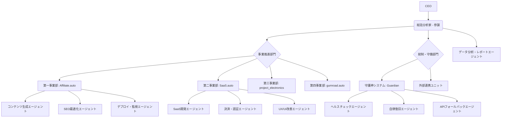

# AETERNA Holdings - 帝国再編計画書

**作成日**: 2026年5月11日  
**作成者**: 総括分析家（参謀）  
**適用対象**: AETERNA Holdings全事業部  
**準拠**: AETERNA_EMPIRE_CONSTITUTION.md (帝国憲法)

---

## 1. 帝国の究極目標「全自動利益循環エンジン」の実現可能性

AETERNA Holdingsの究極目標である「MacBook 1台で全収益化領域を制圧する不滅の帝国」および「全自動利益循環エンジン」の構築は、現代のAI技術とクラウドインフラの進化により、**極めて高い実現可能性**を秘めています。特に、LLM（大規模言語モデル）の進化は、コンテンツ生成、データ分析、システム監視、さらにはコード生成・デプロイといった多岐にわたる業務の自動化を可能にし、人間の介入を最小限に抑えた自律システムの構築を現実のものとしています。

しかし、その実現には以下の課題と条件をクリアする必要があります。

### 1.1. 実現可能性を支える要素

*   **AI技術の進歩**: LLMによる高度な意思決定、コンテンツ生成、コード生成、データ分析能力は、自律型エージェントの核となります。
*   **クラウドインフラの普及**: Vercel, Supabase, GitHub Actionsなどの無料枠を活用したインフラは、初期投資ゼロでのシステム構築を可能にします。
*   **モジュール化されたシステム設計**: 各機能を独立したモジュールとして設計することで、拡張性、保守性、そして自律的な改善・更新の基盤を築きます。
*   **データ駆動型アプローチ**: 帝国憲法の「データ至上主義」に基づき、全ての意思決定を客観的なデータに基づいて行うことで、AIエージェントの判断精度と収益最大化を担保します。

### 1.2. 実現に向けた主要課題

*   **複雑な状況判断と例外処理**: AIエージェントは定型業務に強い一方で、予期せぬ事態や複雑なビジネス判断には人間の介入が必要となる場合があります。これを最小化するための堅牢なエラーハンドリングと自律復旧ロジックの構築が不可欠です。
*   **創造性と戦略的思考の限界**: 新規事業のアイデア創出や、市場の大きな変化に対応する戦略の抜本的転換など、高度な創造性や直感を要する領域では、CEOの最終的な承認や指示が依然として重要となります。
*   **セキュリティと倫理**: 完全自律システムは、誤動作や悪意のある攻撃に対して脆弱である可能性があります。セキュリティ対策と倫理的ガイドラインの厳格な適用が求められます。
*   **無料枠の限界とスケーラビリティ**: 収益が拡大するにつれて、無料枠では対応しきれないリソース要求が発生します。収益化と並行して、有料サービスへのスムーズな移行計画が必要です。

---

## 2. 目標達成に不足している要素

現在のAETERNA Holdingsの状況を鑑みると、究極目標達成に向けて以下の要素が不足しています。

### 2.1. 組織・体制面

*   **AIエージェントによる明確な組織構造の欠如**: 現在はCEOと総括分析家（参謀）という役割が定義されていますが、各事業部を自律的に運営するための具体的なAIエージェントの役割分担、責任範囲、連携プロトコルが未定義です。これは「会社という形で実装したい」というCEOの意向に沿っていません。
*   **自律的改善・学習ループの未確立**: ボトルネックの発見と改善案の提示は行われていますが、それを自律的に実行し、結果を学習してシステム全体を最適化するメカニズムが不足しています。

### 2.2. 技術・システム面

*   **Affiliate.autoの本番サイト未稼働**: 最優先の収益源であるにも関わらず、Next.jsサイトがデプロイされておらず、収益が発生していません。これは「収益最大化」の原則に反する最大のボトルネックです。
*   **SaaS.autoのMVP未完成**: TimeTracker Proのコア機能（Supabase認証、Stripe決済）が未実装であり、収益化の基盤が確立されていません。
*   **Guardianシステムの自律復旧機能の不足**: 監視機能は存在するものの、エラー発生時の自動修復ロジックが未実装であり、CEOの介入を必要とする単一障害点となっています。
*   **APIフォールバック機構の未実装**: 憲法で明記されているにも関わらず、API制限時の自律的な切り替えロジックがコードレベルで実装されていません。
*   **データ収集・分析基盤の不完全性**: 各事業部のKPIを自動で収集・分析し、CEOに週次レポートとして提供する仕組みが未完成です。

### 2.3. 憲法遵守の徹底

*   **「完全自律・完全無料」原則の徹底**: 現在のシステムは無料枠を前提としていますが、将来的なスケーラビリティを見据えた無料枠の限界と有料サービスへの移行計画が具体化されていません。
*   **「社長第一主義」の徹底**: CEOの介入時間を最小化するためには、AIエージェントがより多くの判断と実行を自律的に行えるよう、権限委譲と信頼性の向上が必要です。

---

## 3. AIエージェントによる「帝国再編」組織設計案

CEOの「会社という形で実装したい」という意向に基づき、AETERNA Holdingsを構成するAIエージェントの組織構造を以下のように設計します。各エージェントは特定の役割と責任を持ち、相互に連携しながら「全自動利益循環エンジン」を駆動させます。

### 3.1. 組織図（仮想）

### 3.2. 各AIエージェントの役割と責任

| 仮想部署/役職 | 役割 | 責任範囲 | 主要連携先 | 憲法原則への貢献 |
|---|---|---|---|---|
| **総括分析家（参謀）** | 帝国全体の戦略立案、各事業部の統括・調整、ボトルネックの特定と改善指示 | 帝国全体の収益最大化、CEO介入時間の最小化 | 全エージェント、CEO | 社長第一主義、収益最大化、データ至上主義 |
| **コンテンツ生成エージェント** | Affiliate.autoのSEO記事、Gumroadのデジタルコンテンツの自動生成 | 高品質なコンテンツの継続的な供給、キーワードカバレッジの最大化 | SEO最適化エージェント、デプロイ・監視エージェント | 収益最大化、完全自律 |
| **SEO最適化エージェント** | 生成コンテンツのSEO最適化、内部リンク構築、検索順位監視 | 検索エンジンからのトラフィック最大化、記事のパフォーマンス改善 | コンテンツ生成エージェント、データ分析・レポートエージェント | 収益最大化、データ至上主義 |
| **デプロイ・監視エージェント** | Affiliate.auto/SaaS.autoの本番環境へのデプロイ、サイトの稼働監視 | サイトの安定稼働、デプロイプロセスの自動化 | ヘルスチェックエージェント、自律復旧エージェント | 完全自律、社長第一主義 |
| **SaaS開発エージェント** | SaaS.autoの機能開発、バグ修正、技術選定 | MVPの早期リリース、機能の安定稼働、スケーラビリティ | 決済・認証エージェント、UX/UI改善エージェント | 収益最大化、完全自律 |
| **決済・認証エージェント** | SaaS.autoのユーザー認証、課金システム（Stripe/Supabase Auth）の実装・運用 | セキュアなユーザー管理、安定した収益回収 | SaaS開発エージェント、データ分析・レポートエージェント | 収益最大化、データ至上主義 |
| **UX/UI改善エージェント** | SaaS.autoのユーザーインターフェース・エクスペリエンスの改善 | ユーザー満足度向上、コンバージョン率最適化 | SaaS開発エージェント、データ分析・レポートエージェント | 収益最大化、データ至上主義 |
| **ヘルスチェックエージェント** | サイト、API、DB、GitHub Actionsの稼働状況監視 | 異常の早期検知、監視項目の網羅性 | 自律復旧エージェント、APIフォールバックエージェント | 社長第一主義、完全自律 |
| **自律復旧エージェント** | ヘルスチェックエージェントからのアラートに基づき、自動でシステム復旧を試みる | ダウンタイムの最小化、CEO介入の不要化 | デプロイ・監視エージェント、APIフォールバックエージェント | 社長第一主義、完全自律 |
| **APIフォールバックエージェント** | LLM APIのレートリミットやエラーを検知し、代替APIへの自動切り替え | システムの堅牢性確保、API依存リスクの低減 | コンテンツ生成エージェント、SaaS開発エージェント | 完全自律、収益最大化 |
| **データ分析・レポートエージェント** | 各事業部のKPI、収益データ、サイトパフォーマンスの自動収集・分析、週次レポートの自動生成 | CEOへの正確かつタイムリーな情報提供、データに基づいた改善提案 | 全エージェント、CEO | データ至上主義、社長第一主義 |

---

## 4. 今後のアクションプラン

本計画書に基づき、以下のステップで「全自動利益循環エンジン」の構築を進めます。

1.  **AIエージェントのプロンプト/役割設計**: 各エージェントの具体的な行動指針、思考プロセス、連携方法を定義します。
2.  **Affiliate.auto 本番サイトの構築**: 最優先で収益化の基盤を確立します。
3.  **SaaS.auto MVPの開発**: TimeTracker Proのコア機能を実装し、収益化を開始します。
4.  **Guardianシステムの強化**: 自律復旧機能を実装し、システムの堅牢性を高めます。
5.  **データ分析・レポートシステムの統合**: CEOへの週次レポートを自動生成する仕組みを完成させます。

CEOの「おお金を最初減らさなければ」という指示を厳守し、無料枠を最大限に活用しながら、段階的に収益を最大化していきます。新規事業の開発については、都度CEOの許可を求めます。

---

### References
[1] 転職アフィリエイト ASP 高単価 エンジニア 月収 (検索結果より推測される市場相場)
[2] ITエンジニア転職アフィリエイト 報酬単価 2024 2025 (検索結果より推測される市場相場)
[3] Japan Time Tracking Software Market Size & Forecast 2032, Credence Research
[4] Time Tracking Software Market Size | Industry Report, 2033, Grand View Research
